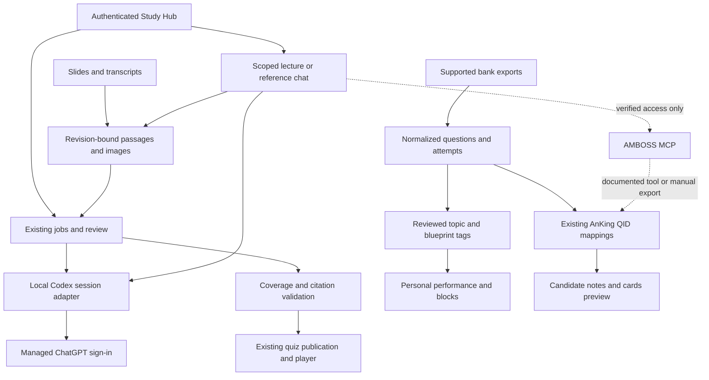

# GPT Study Platform — approved architecture

Date: 2026-09-11. Connor approved the architecture in **Evaluate GPT pipeline alternative** and requested a handoff-ready multi-worker implementation plan. This spec records that approval; it does not claim that the implementation or provider acceptance has happened.

## Outcome and priorities

Study Hub remains the application and source of record. Replace Gemini/NotebookLM as required dependencies for transcript processing, lecture-quiz generation, question import, and new source-grounded chat with a subscription-first GPT backend. Use Codex's documented managed ChatGPT login through a local app-server process. Keep the existing OpenAI API adapter available, but never enable paid API fallback silently. A subscription limit pauses/queues work; it is not an error that permits changing accounts, consuming a reset, or spending API credit.

First deliver the useful daily workflow: original slides and cleaned transcripts become clinical-vignette quizzes with real lecture figures, complete objective coverage, explanations, and resolvable citations. Student-facing outlines are optional. Existing Anki curation is deferred and its outline prerequisite must not prevent the new workflow.

Later increments add supported UWorld/TrueLearn imports, exact question-to-AnKing matching, medical/reference chat with AMBOSS when access is established, competency tracking, cumulative practice, and candidate deck building. Each increment must work independently of optional external access.

## Evidence and current state

- Inspected local checkout: `f487c622` with unrelated dirty/untracked UI and documentation files. This is not verified production state. The execution orchestrator must choose a fresh verified integration base and preserve other work.
- Existing `llm/openai.py` implements Responses API text/structured generation; `llm/provider.py` and `llm/service.py` assume API-key credentials. A managed-session adapter must not fake a key to satisfy that interface.
- `study_generation/service.py` and `worker.py` use source revision bindings for slides/transcript, but currently require NotebookLM connectivity. Quizzes do not consume the outline. `web/anki_routes.py` still requires an outline for curation; leave that dormant workflow intact.
- Existing document-processing, practice-review, native quiz, media and publication modules are reusable. The public player records answers in browser storage; server-side personal performance cannot be inferred from published quizzes or browser state.
- Source passages/extraction already exist under `anki/sources.py`. Its outline parameter is optional. The existing semantic source index requires an embedder; do not accidentally add a Voyage/API requirement to subscription-first chat.
- The Heme exemplar artifacts are under `/Users/connor/Documents/Codex/2026-09-10/the-following-learning-objectives-are-a/outputs/`: 50 questions, 46 requested objectives, 30 figures. Reference scripts retain slide/image provenance. This is a reference for quality and native format, not a hardcoded output or license to upload private materials during tests.
- The GitHub UWorld-like JSON contains 3,671 items, 149 invalid answer indices, and 94 absent image assets. Historical IDs differ across versions. Preserve it as a distinct held source; never equate its IDs with original UWorld QIDs.

## System boundaries

One Hub-owned local Codex process/client serializes model turns initially. Generation and chat share this scheduler; do not start a second hidden backend for chat. Authentication stays in Codex-managed storage owned by the execution account. Use documented stdio JSONL, not experimental public WebSocket hosting. No direct session-token calls to private ChatGPT endpoints, browser automation backend, or cookie extraction.

The NUC is the intended service host. A same-account Windows service/task environment proof is required before activation. Model availability, images, structured output, account limits, and process cancellation are verified capabilities, not inferred from model names. Persist local job identity and remote thread/turn identity before accepting results. An ambiguous interrupted request becomes an explicit interrupted/unknown state; do not automatically duplicate generation.

## Source and quiz requirements

1. Snapshot selected revision IDs and hashes, course/exam/lecture, objectives, and actual figure locators. Reject stale or mismatched bindings.
2. Preserve source styles/emphasis where available, including professor red text/high-yield markings. Text-only extraction is insufficient for a question requiring a visual.
3. Build an internal coverage map with stable objective IDs and cited passages/figures. Every requested objective must have a question or an explicit source-gap blocker. At least three questions per lecture is the default floor, not a substitute for coverage.
4. Generate independent clinical vignettes with first- through third-order reasoning where supported. Attach original figure assets when educationally relevant; no invented diagnostic images or guessed locators. Avoid answer-bearing labels/captions in pre-answer view; retain original provenance when making a documented presentation crop.
5. Correct answer and distractor explanations cite supplied evidence. Medical reference enrichment never silently changes a lecture-only question.
6. Validate schema, answer choice/index, duplicates, coverage, image availability/association, and citation membership. Schema validity does not prove medical correctness: release review includes a hand-reviewed representative set with image and emphasis cases.
7. Reuse native import/review/publication. Produce native JSON, image bundle and a readable PDF from the same accepted payload. No auto-publication solely because text parsed successfully.
8. Outline generation is opt-in. Preserve previously created outlines and dormant Anki use; do not delete artifacts or existing schemas in this migration.

## Bank imports and Anki identifiers

Import supported user exports, not authenticated scraping. Separate complete question records from results/QID/notes-only records. UWorld documents printable notes, per-test analysis and performance reports, not general Qbank export ([official guidance](https://www.uworld.com/contact_us.aspx)). TrueLearn sample format and available fields must be inspected before a vendor-specific parser is accepted.

Use `(source, product, external_question_id)` string identity and source revision/hash. Preserve original categories. Import attempts independently from question content; unknown results remain unknown. Reimport is idempotent and cannot inflate attempts. CSV formula text remains inert, archive paths cannot escape the import directory, and absent answer/images hold an item from graded practice.

Add reviewed multi-axis tags: organ system, discipline, topic, local lecture/objective, exam blueprint/version. Classify using actual question/objective evidence; do not infer disease content from a bare QID. Preserve model suggestion, review state, and original labels.

Reuse AnKing's existing QID tag conventions and approved local index/AnkiConnect gateway. [AnkiHub](https://www.ankihub.net/step-deck?lang=en) documents UWorld/AMBOSS mapping; newly documented TrueLearn mappings are checked against the installed deck/product before use. Never conflate vendor QID, AnKing stable identity, local NID and card ID. One note may produce several cloze cards. Unknown mappings are explicit misses; semantic recommendations never masquerade as exact matches.

First release exports an Anki search / ID list and reviewable candidate set. Later approved tag/filtered-deck changes reuse current apply safeguards, preserve source-managed tags and scheduling, and never clone existing AnKing notes into a duplicate deck. Full automated curation/gap-card generation remains deferred.

## Chat and AMBOSS

User-visible modes are **Lecture sources**, **Medical reference**, and **General**. Lecture mode searches only server-validated selected revisions and uses resolvable passage citations. Medical reference mode uses only a verified AMBOSS adapter/entitlement; unavailable access is visible and offers the official AMBOSS experience. General mode cannot display an AMBOSS-backed badge or fabricated reference. Cross-mode changes are explicit.

Persist conversations with owner identity, mode, source revision snapshot, model, and provider state. Clear/reset is an owner operation. Sanitize rendered Markdown/links. Treat all source/retrieval content as data; it cannot instruct shell execution, source expansion, email, or Anki changes. The model has no mutation tools in these flows.

AMBOSS's public MCP announcement establishes existence, not endpoint/auth/pricing/NID tools. Consumer AI Mode Learning and the AMBOSS GPT are distinct from developer MCP entitlement. Public terms make external-model/storage rights a required access question. Findings: [research](../../implementation/2026-09-11-amboss-access-research.md). Connor authorized and Gmail confirmed sending [the inquiry](../../implementation/2026-09-11-amboss-product-inquiry.md); do not resend. A reply is not assumed and no subscription purchase is authorized.

Implement the optional UI and local fake-tested reference boundary now. Implement the real AMBOSS wire adapter only from official supplied documentation/permission. Until then, the optional capability is marked external-access pending; it cannot hold lecture quizzes or general chat. Candidate NID import works manually regardless of API access. AnkiHub Smart Search can be evaluated as a consumer alternative, not presumed to have an API.

## Performance, practice and existing ideas

Personal attempts require authenticated owner identity, server grading, stable question version and idempotent submission identity. Do not record anonymous/public users' answers as Connor's performance. Existing public quiz access remains unchanged. Imported provider attempts retain their source and provenance; they are not automatically equivalent in difficulty to generated lecture questions.

Track first attempts and repeats separately, sample counts, dates, and recent performance. Group reviewed topic assignments without double-counting overall totals. No fabricated pass probability or validated readiness claim. COMLEX Level 1 uses **NBOME**, with competency and presentation dimensions; USMLE Step 1 uses its separate official outline. Store taxonomy versions and crosswalks; never relabel one as the other. See [NBOME](https://www.nbome.org/assessments/comlex-usa/level-1/).

Offer custom/cumulative blocks by course/exam/topic, plus deterministic weakest/under-practiced selection, exclusions and deduplication. Existing source-only and mixed-board practice stay distinguishable. Preserve seven-pass target semantics and dates/resources. The September 9 sixteen-item UX resolution record is regression evidence, not new scope; verify integrated status before reusing it. ExtendLM is superseded as the core direction, not another mandatory integration.

## Delivery, testing and autonomy

Four roles: O orchestrator/integration, B backend/quizzes, Q imports/Anki mapping, C chat/progress. O creates worker tasks itself and grants helpers within a concurrency budget. B/Q/C do not edit shared `app.py`, `models.py`, `migrations.py`, `config.py`, or global navigation simultaneously; submit exact shared patches to O. Each task has a fresh reviewer and one accepted commit before dependent integration. No ten-layer agent hierarchy or generated orchestration framework.

Acceptance proceeds by independently releasable slice: local contract tests; actual Windows transport proof; one bounded live synthetic provider proof; reviewed source-grounded quiz; optional integrations separately. A failed boundary is diagnosed and fixed at its owner before a bounded retry; never reproduce Gate 2B's global retry/composition loop. Mock success is labeled local, not provider acceptance.

The handoff authorizes local implementation, isolated worktrees, worker creation, tests, local commits and integration into a candidate branch. It does not itself authorize production restart/deployment, deleting retained Gate 2B resources, purchasing subscriptions, live Anki mutation, or private-source uploads. User-triggered source selection/generation provides scope for that user operation. O prepares a concrete release candidate and asks only for unavoidable user login/export or final live action. Never stop all lanes because one optional service is unavailable.

## Official backend references

- [Codex app-server](https://learn.chatgpt.com/docs/app-server): documented managed login, stdio, conversation/turn events and structured results.
- [Authentication](https://learn.chatgpt.com/docs/auth): ChatGPT subscription versus API-key access.
- [Codex SDK](https://learn.chatgpt.com/docs/codex-sdk): alternative automation surface; avoid adding a Node bridge when the Python stdio client satisfies requirements.

## Completion definition

Core completion requires usable signed-in generation/chat, validated review/publish, optional outlines, source/media integrity, restart/limit handling and existing-flow regression evidence. Each external lane separately reports implemented, locally tested, provider verified, or externally pending. The program cannot claim AMBOSS API or real bank export support merely because a stub or normalized sample passed. Deferred full Anki curation is reported as intentionally outside the current activation scope.
